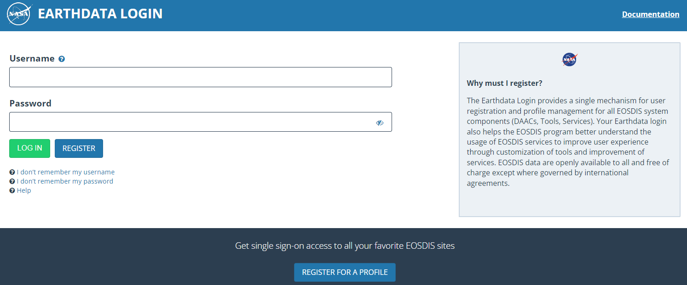
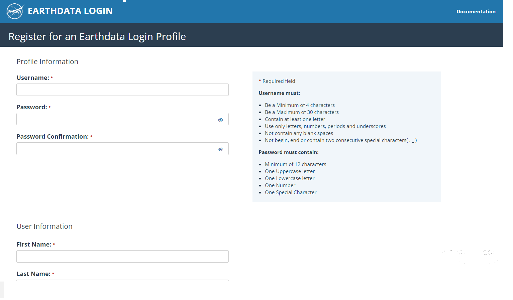

# Getting NASA Earthdata Credentials

This notebook lays out the process to obtain for NASA Earthdata credentials.

**You can complete this step before the day of the actual tutorial.**

## Brief Introduction

The [NASA Earth Science Data Systems (ESDS)]() program oversees the lifecycle of Earth science data from all its Earth observation missions, from acquisition to processing and distribution. The goal is to make NASA's data accessible to accelerate scientific progress for the benefit of society. For the purposes of this guide, the [NASA Earthdata website](https://www.earthdata.nasa.gov/) is the entry point that allows full, free and open access to NASA's Earth science data collections.

## Registering your EarthData Credentials

To use this portal, users must first register their EarthData account credentials by following these steps:

+ Go to the Earth Nasa website: [`https://www.earthdata.nasa.gov/`](https://www.earthdata.nasa.gov/). Then, select the menu options "*Use Data*" and then "*Register*". Finally, navigate to [`https://urs.earthdata.nasa.gov/`](https://urs.earthdata.nasa.gov/).

 

+ Select the "*Register for a profile*" option, there choose a username and password. You will need these later, so choose ones that you remember well. You will have to provide other information for your profile (e.g., email, country, and affiliation). Finally, choose "*Register for Earthdata Login*".

