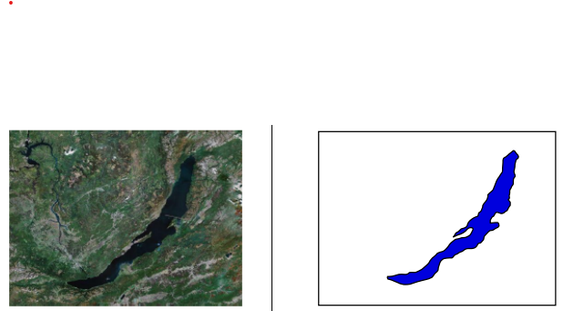

# Geospatial data

Throughout this tutorial, we'll use various kinds of geospatial data, notably [*raster* data and *vector* data](https://www.geographyrealm.com/geodatabases-explored-vector-and-raster-data/).

## Raster data

Raster data represents geographic data as a matrix of cells containing an attribute value. While the area of different polygon shapes in a data set can differ, each cell in a raster data set is the same cell. The size of the area in the real world that each cell represents is known as the spatial resolution.

This image shows an example of raster data. Source: National Ecological Observatory Network (NEON).

## Vector data

*Vector data* is split into three types: point, line, and polygon data.

This image shows the three vector types: points, lines and polygons. Source: National Ecological Observatory Network.

### Point data

Point data is most commonly used to represent nonadjacent features and discrete data points. Points have zero dimensions, therefore you can measure neither length or area with this dataset.^1^

This image shows an example of a spatial entity (left) and its point vector representation (right). Source: " Sistemas de Información Geográfica" by Victor Olaya.

### Line Data

Line data is used to represent linear features. Common examples would be rivers, trails, and streets.  Line features only have one dimension and therefore can only be used to measure length.  Line features have a starting and ending point. Common examples would be road centerlines and hydrology.

This image shows an example of a spatial entity (left) and its line vector representation (right). Source: " Sistemas de Información Geográfica" by Victor Olaya.

### Polygon data

Polygons are used to represent areas such as the boundary of a city (on a large-scale map), lake, or forest.  Polygon features are two-dimensional and therefore can be used to measure the area and perimeter of a geographic feature.

This image shows an example of a spatial entity (left) and its point vector representation (right). Source: " Sistemas de Información Geográfica" by Victor Olaya.

