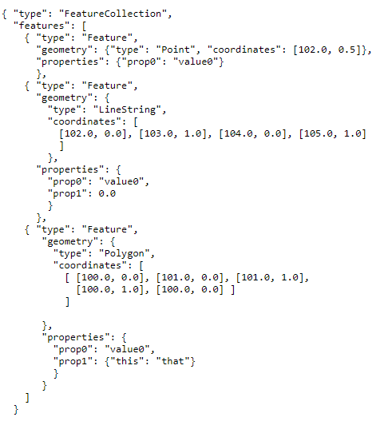

# Geospatial data formats

## Vector data formats

In this tutorial, we will be using the following vector data formats:

### 1. SHP

Shapefile is the most widely known format for distributing geospatial data. It is a standard first developed by ESRI almost 30 years ago, which is considered ancient in software development.1 

The shapefiles consist of several files some of them are mandatory and others optional. The mandatory file extensions needed for a shapefile are .shp, .shx, and .dbf. But the optional files are .prj, .xml, .sbn, and .sbx. 2  This makes operating Shapefiles slightly clunky and confusing. However, Shapefile has been around for so long that any GIS software supports handling it.1

In the following, we show a list and a brief explanation of all the files that make up a shapefile, including shp, shx, dbf, prj, xml,sbn, sbx, and cpg based on 2.

**Mandatory files**
- Main File (.shp): shp is a mandatory Esri file that gives features their geometry. Every shapefile has its own .shp file that represents spatial vector data. For example, it could be points, lines, and polygons in a map.

- Index File (.shx): shx is a mandatory Esri and AutoCAD shape index positions. This type of file is used to search forward and backward.

- dBASE File (.dbf): dbf is a standard database file used to store attribute data and object IDs. A .dbf file is mandatory for shape files. You can open DBF files in Microsoft Access or Excel.

**Optional files**
- Projection File (.prj): prj is an optional file that contains the metadata associated with the shapefiles coordinate and projection system. If this file does not exist, you will get the error “unknown coordinate system”. If you want to fix this error, you have to use the “define projection” tool which generates .prj files.

- Extensible Markup Language File (.xml): xml file types contain the metadata associated with the shapefile. If you delete this file, you essentially delete your metadata. You can open and edit this optional file type (.xml) in any text editor.

- Spatial Index File (.sbn): sbn files are optional spatial index files that optimize spatial queries. This file type is saved together with a .sbx file. These two files make up a shape index to speed up spatial queries.

- Spatial Index File (.sbx): sbx files are similar to .sbn files which speed up loading times. It works with .sbn files to optimize spatial queries. We tested .sbn and .sbx extensions and found that there were faster load times when these files existed. It was 6 seconds faster (27.3 sec versus 33.3 sec) compared with/without .sbn and .sbx files.

- Code Page File (.cpg): cpg files are optional plain text files that describe the encoding applied to create the shapefile. If your shapefile doesn’t have a .cpg file, then it has the system´s default encoding.

Internally, Shapefile uses Well-known binary (WKB) for encoding the geometries. 4 This is a compact format that is based on tabular thinking, i.e. the row and column number of a value is significant. A minor nuisance is the limitation of the attribute field names to 10 characters and poor Unicode support, so some abbreviations and forcing to ASCII may have to be used.^3^

For more details about the shapefiles you can refer to the [ESRI Shapefile Technical Description](https://www.esri.com/content/dam/esrisites/sitecore-archive/Files/Pdfs/library/whitepapers/pdfs/shapefile.pdf)

### 2. GeoJSON

GeoJSON is a subset of [JSON (JavaScript object notation)](https://www.json.org). It was developed 10 years ago by a group of enthusiastic GIS developers. The core idea is to provide a specification for encoding geospatial data while remaining decodable by any JSON decoder.3

This image shows an example of a GeoJson file. Source: https://gist.githubusercontent.com/wavded.

Being a subset of the immensely popular JSON, the parsing support is on a different level than with Shapefile. In addition to support from most GIS software, any web developer will be able to write a custom GeoJSON parser, opening new possibilities for integrating the data.3

Being designed as one blob of data instead of a small "text database" means it is simpler to handle but is essentially designed to be loaded to memory in full at once.^3^ 

For more information about GeoJSON data formats, you can refer to [https://geojson.org/](https://geojson.org/).

## Raster data formats

In this tutorial, we will be using the following raster data format:

### 1. GeoTiffs

[GeoTIFF](https://en.wikipedia.org/wiki/GeoTIFF) is a public domain metadata standard that enables georeferencing information to be embedded within a [TIFF](https://en.wikipedia.org/wiki/TIFF) file. The GeoTIFF format embeds geospatial metadata into image files such as aerial photography, satellite imagery, and digitized maps so that they can be used in GIS applications.3

A GeoTIFF file extension contains geographic metadata that describes the actual location in space that each pixel in an image represents. In creating a GeoTIFF file, spatial information is included in the .tif file as embedded tags, which can include raster image metadata such as:
* horizontal and vertical datums 
* spatial extent, i.e. the area that the dataset covers
* the coordinate reference system (CRS) used to store the data
* spatial resolution, measured in the number of independent pixel values per unit length
* the number of layers in the .tif file
* ellipsoids and geoids - estimated models of the Earth’s shape
* mathematical rules for map projection to transform data for a three-dimensional space into a two-dimensional display.

Geodata is drawn from vector formats on a map, and the geodata is converted to the specified output projection of the map if the projection in the source file differs. Some of the vector and raster formats typically supported by a GeoTIFF online viewer include asc, gml, gpx, json, kml, kmz, mid, mif, osm, tif, tab, map, id, dat, gdbtable, and gdbtablx.3

For more details about GeoTiff data format, you can refer to [OGC GeoTIFF Standard](https://www.ogc.org/standard/geotiff/).

## References
1. https://feed.terramonitor.com/shapefile-vs-geopackage-vs-geojson/
2. https://gisgeography.com/arcgis-shapefile-files-types-extensions/
3. https://www.heavy.ai/technical-glossary/geotiff
4. https://libgeos.org/specifications/wkb/
